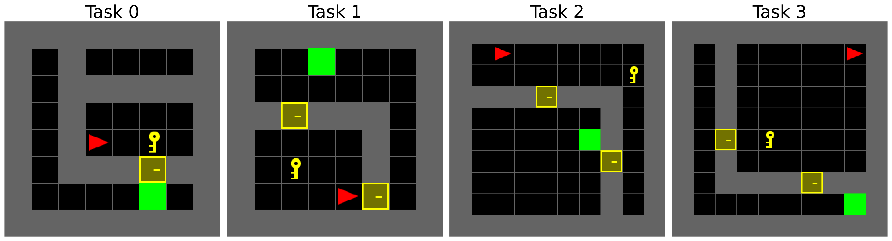
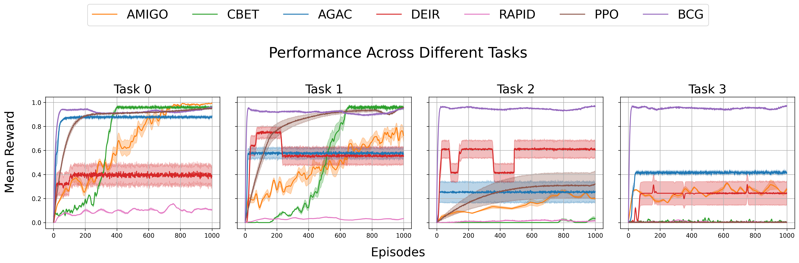

# Bayesian Curriculum Generation Algorithm

## Overview
This repository hosts the Bayesian Curriculum Generation Algorithm (BCG), an innovative approach designed for curriculum learning within sparse reward reinforcement learning environments. Unlike traditional methods, it employs Bayesian networks to dynamically generate tasks by modifying problem parameters, influencing task difficulty and offering compatibility with various RL techniques.

## Key Features
- **Dynamic Task Generation:** Uses Bayesian networks for real-time task creation, adjusting complexity based on learning progression.
- **Unsupervised Task Classification:** Implements clustering for task categorization based on difficulty, applicable to image outputs and scalar values without extensive task-specific training.
- **Adaptive Learning:** Modulates task difficulty in response to agent performance, enhancing learning efficiency by presenting progressively challenging tasks or adjusting current task complexity.

## Environments
The environments for training both the proposed approach and benchmark algorithms are illustrated below:



## Results
The results from the test evaluations are presented here:



## Installation and Training
To install the environment and execute the training, run the following commands:
```bash
git clone https://github.com/AkgunOnur/BayesianCurriculumGenerator
cd BayesianCurriculumGenerator
pip install -r requirements.txt 
python train_minigrid.py --train_type "Curriculum"
